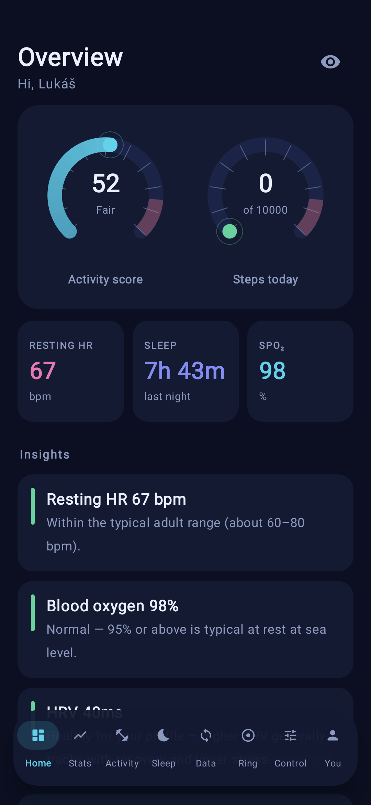

# Ring Set

A native **Android** companion app for **Colmi R0x-family** smart rings (the ones sold
with the **QRing** app) that talks to the ring directly over **Bluetooth LE** — no account,
no cloud, fully offline. It started as a way to set the heart-rate logging interval and grew
into a full, private replacement for the stock app: live heart rate, sleep stages, trends,
insights and data export.

<p align="center">
  
</p>

## Features

An eight-tab Jetpack Compose app with a floating navigation bar:

- **Home (Overview)** — a daily snapshot: an **activity-score** gauge and a **steps-toward-goal**
  gauge (tachometer style), resting-HR / sleep / SpO₂ tiles, and plain-language, evidence-informed
  **insights** built from your readings + profile.
- **Stats** — scrub-to-zoom line charts per metric (heart rate, SpO₂, HRV, stress, steps) with
  live average / min / max / latest tiles over the visible window.
- **Activity** — **real-time heart rate**: start a session and the ring streams your pulse (great
  for a lift or a run); stop to save an avg / max / duration summary. Or "mark activity" to log a
  window without live monitoring (also mutes HR alerts during exercise).
- **Sleep** — total sleep + a **sleep-score** gauge, an interactive **hypnogram** (tap/drag to
  inspect a stage's type, length and from–to time), per-stage breakdown, sleep HR & SpO₂, and a
  **draggable 24-hour bedtime/wake goal dial**.
- **Data** — one-tap **Sync** pulls the ring's stored logs (**HR, steps, SpO₂, sleep, stress, HRV**),
  merges them into CSVs, and shares/exports them.
- **Ring** — battery %, connection state, and **multiple rings** (scan, name, switch).
- **Control** — heart-rate logging **interval** presets (1 · 3 · 5 · 10 · 30 · 60) + a custom
  1–255 min setter, a "reconnect after setting" option, and **HR alerts** (spike / prolonged-high).
- **You (Profile)** — age, sex, height, weight, resting HR and goals that personalise the insights;
  resting HR can be typed, computed from your data, or **measured on the spot**.

The official QRing app only logs heart rate every **30 or 60 minutes**; Ring Set writes the raw
BLE command so you can pick **any interval from 1 to 255 minutes** for much denser HR/HRV data.

> **Note:** on this hardware blood-oxygen (SpO₂), stress and HRV are on/off toggles with no separate
> interval — they sample alongside the HR cycle, so lowering the HR interval increases how often
> they're taken. Sleep is auto-detected.

## Build & install

The app is tied to a specific ring's BLE address, so there's no generic prebuilt APK — you build
it with **your** ring's MAC (see [Configure your ring](#configure-your-ring)).

Requires a JDK 17+ and the Android SDK (`ANDROID_HOME` set, or a `local.properties` with
`sdk.dir=...`). The Gradle wrapper fetches Gradle itself:

```bash
RING_MAC=AA:BB:CC:DD:EE:FF ./gradlew assembleDebug   # gradlew.bat on Windows
# APK: app/build/outputs/apk/debug/app-debug.apk
```

Copy that APK to your phone and open it (enable *Install unknown apps* if prompted), or install
over USB (Developer options → USB debugging):

```bash
RING_MAC=AA:BB:CC:DD:EE:FF ./gradlew installDebug
```

On Windows there's a convenience script `./build-and-install.ps1` (reads the MAC from
`local.properties`).

## Configure your ring

The ring's BLE address is **not** stored in this repo — supply your own at build time (find it in
the QRing app, or scan with a BLE tool like nRF Connect):

- **Environment variable:** `RING_MAC=AA:BB:CC:DD:EE:FF ./gradlew assembleDebug`
- **or `local.properties`** (git-ignored) in the project root: `ring.mac=AA:BB:CC:DD:EE:FF`

It's injected into `BuildConfig.RING_MAC` and read at runtime. Without it the build falls back to a
placeholder (`00:00:00:00:00:00`) that connects to nothing.

## Usage

1. **Wake the ring** — take it off the charger / put it on, so it advertises.
2. **Close the QRing app** — BLE allows only one connection at a time; if the official app is
   connected this one can't reach the ring (and vice-versa).
3. Open **Ring Set**. First launch asks for *Nearby devices* (Bluetooth) and notification
   permissions — allow them.
4. **Data → Sync now** pulls your logs; **Control** sets the interval; **Activity → Start** streams
   live HR (wear the ring snugly — it locks a reading after ~30 s).

## Your data

**Data → Sync now** reads the ring's stored logs and merges them into CSVs in the app's private
files dir:

| file | columns |
|---|---|
| `ring_hr.csv` | `timestamp,epoch_s,bpm` |
| `ring_steps.csv` | `timestamp,epoch_s,steps` (15-min buckets) |
| `ring_spo2.csv` | `timestamp,epoch_s,spo2` (hourly %) |
| `ring_sleep.csv` | `timestamp,epoch_s,stage,stage_label,duration_min` (light/deep/rem/awake) |
| `ring_stress.csv` | `timestamp,epoch_s,stress` (30-min) |
| `ring_hrv.csv` | `timestamp,epoch_s,hrv_ms` |

The ring only keeps a small rolling buffer, so sync regularly — the merge keeps everything you've
already pulled. Get it off the phone via the in-app **Export & share** (Android share sheet) or with
[`pull-data.ps1`](pull-data.ps1) → copies every CSV to a folder on your PC (default
`Desktop\ring-data`); see [AGENTS.md](AGENTS.md).

## How it works

The ring exposes a Nordic-UART-style GATT service. Commands are 16-byte packets
`[cmd, …subdata…, checksum]` where `checksum = sum(bytes[0:15]) % 255`.

| | value |
|---|---|
| Service | `6E40FFF0-…` · Write (RX) `6E400002-…` · Notify (TX) `6E400003-…` |
| Set / read interval | `0x16 0x02 0x01 <min>` / `0x16 0x01` |
| HR / steps / stress / HRV logs | `0x15` / `0x43` / `0x37` / `0x39` (tagged, multi-packet) |
| Battery | `0x03` |
| Real-time HR | start `0x69 0x01 0x00`, poll cmd 30 `0x1E 0x03` (~1 s), stop `0x6A 0x01 0x00 0x00` |

SpO₂ and sleep use a second **"big data" channel** (service `de5bf728…`): a 7-byte request
`[0xbc, type, 01 00 ff 00 ff]` (`0x2a` SpO₂ / `0x27` sleep) and a length-framed response reassembled
across notifications. Protocol reverse-engineered from Gadgetbridge, colmi_r02_client, and the
QRing/Oudmon SDK (real-time HR).

## Architecture

See [docs/ARCHITECTURE.md](docs/ARCHITECTURE.md) for the full breakdown. In short, a layered MVVM app:

```
ble/         RingBle (connection + sync state machine + live HR) · RingProtocol (pure wire codec)
data/        Room entities/DAO/DB · RingRepository · models (MetricType, UserProfile, Workout…)
domain/      StatsEngine · SleepEngine · Interpretation · AlertEngine   (pure analytics, no Android UI)
ui/          App (nav) · RingViewModel · Theme
ui/components/  reusable library: ArcGauge, MetricChart, Hypnogram, SleepGoalDial, ScreenHeader, Widgets
ui/screens/     one file per tab: Overview, Stats, Activity, Sleep, Data, Ring, Control, Profile
```

Data flows `RingBle` → `RingRepository` → **Room** → `RingViewModel` → Compose. Analytics live in
`domain/` so new stats/insights slot in without touching the UI. CSV export still writes the same
`ring_*.csv` files for `pull-data.ps1`.

## Tech

Kotlin 2.0.21 · Jetpack Compose + Material 3 · Room · Coroutines/Flow · MVVM · custom Canvas charts.
Gradle 8.9 · AGP 8.5.2 · compileSdk 35 · minSdk 26 (Android 8.0+).

## Credits

Protocol reverse-engineering by [tahnok/colmi_r02_client](https://github.com/tahnok/colmi_r02_client)
and [Gadgetbridge](https://codeberg.org/Freeyourgadget/Gadgetbridge); real-time HR mirrored from the
QRing/Oudmon SDK. An independent hobby project, not affiliated with Colmi or QRing.

## License

[MIT](LICENSE)
